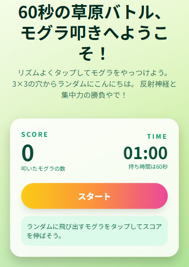

# 🎮 モグラ叩きゲーム (Whack-A-Mole Game)

Next.js + TypeScript + Tailwind CSS で作られた、シンプルで楽しいモグラ叩きゲームです。



## ✨ 特徴

- **60秒間のチャレンジ**: 制限時間内にできるだけ多くのモグラを叩こう
- **3×3のゲームボード**: ランダムに現れるモグラをタップ/クリックで叩く
- **リアルタイムスコア**: 叩いたモグラの数をリアルタイムで表示
- **ヒットフィードバック**: モグラを叩くと視覚的にフィードバック
- **レスポンシブデザイン**: スマホ・タブレット・PCで快適にプレイ可能

## 🚀 クイックスタート

### 開発サーバーの起動

```bash
npm install
npm run dev
```

ブラウザで [http://localhost:3000](http://localhost:3000) を開いてゲームをプレイできます。

### ビルド

```bash
npm run build
npm start
```

## 🛠️ 技術スタック

- **Next.js 14.2** - React フレームワーク
- **React 18** - UI ライブラリ
- **TypeScript** - 型安全な開発
- **Tailwind CSS** - ユーティリティファーストCSS
- **ESLint** - コード品質管理

## 📁 プロジェクト構造

```
app026-mogura-game/
├── app/
│   ├── layout.tsx          # アプリケーションレイアウト
│   └── page.tsx            # メインゲームページ
├── components/
│   ├── ControlPanel.tsx    # スコア・タイマー表示パネル
│   ├── GameBoard.tsx       # 3×3ゲームボード
│   └── Mole.tsx            # モグラコンポーネント
├── lib/
│   ├── random.ts           # ランダム数生成ユーティリティ
│   └── useWhackAMole.ts    # ゲームロジックカスタムフック
└── public/                 # 静的ファイル
```

## 🎯 ゲームルール

1. **スタート**: 「スタート」ボタンを押してゲーム開始
2. **叩く**: 3×3の穴からランダムに現れるモグラをタップ/クリック
3. **スコア**: モグラを叩くたびにスコアが+1
4. **制限時間**: 60秒間でできるだけ多くのモグラを叩こう
5. **終了**: 時間切れで結果表示、再挑戦してベストスコアを目指そう

## 🎨 カスタマイズ

### ゲーム設定の変更

`lib/useWhackAMole.ts` で以下の設定を変更できます：

- **制限時間**: `GAME_DURATION_SEC` (デフォルト: 60秒)
- **モグラ表示時間**: `MOLE_DISPLAY_MS` の範囲 (500ms〜1500ms)

### ヒットフィードバック時間

`app/page.tsx` の `HIT_FEEDBACK_MS` でヒットアニメーションの表示時間を調整できます。

## 📝 ライセンス

このプロジェクトはプライベートプロジェクトです。

## 🙏 クレジット

このゲームは学習・練習目的で作成されました。
